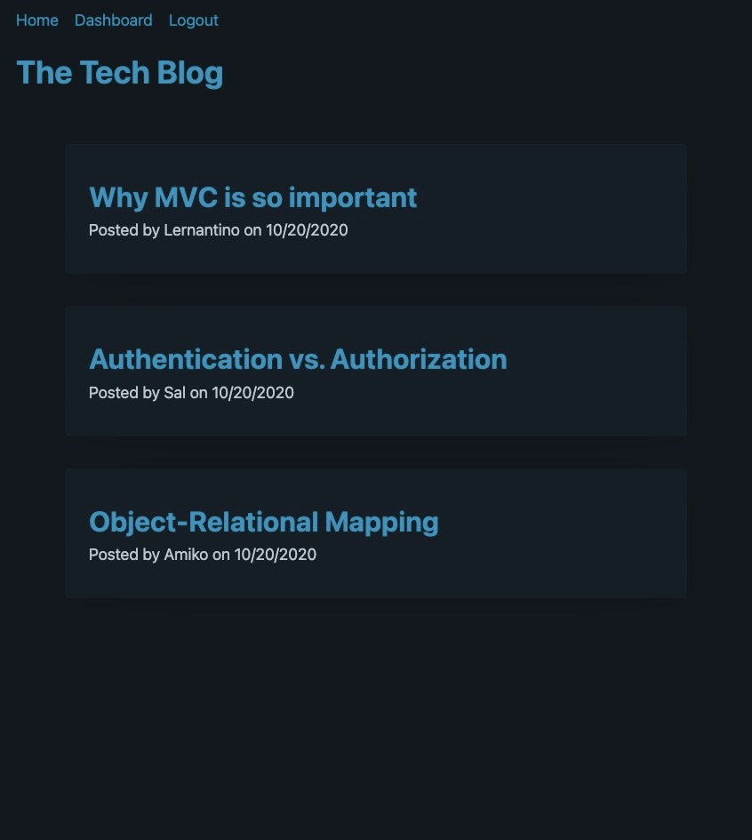

# Tech-Blog
 

## Description

This application is my first full stack development project. The Tech Blog is where developers can publish blog posts and comment on other developers' posts. I had to code the API routes, database, table models, user functionality, user sessions, and page templates. This taught me a lot about managing data, users, and dynamic web pages.    

## Table of Contents (Optional)

- [Usage](#usage)
- [Credits](#credits)
- [License](#license)

## Usage
When first visiting the site, you will see existing posts and a few options along the navigation bar. Anybody is able to view individual posts along with their comments but you must be logged in to submit a comment. You must also be logged in to publish, edit, or delete a post of your own. Simply login or sign up to access all the functionality. Click on the image below to visit the deployed application. 

 

## Credits
- bcrypt
- Express.js
- Handlebars.js
- MySQL and MySQL2 
- Sequelize
- Express-session
- Dotenv
- References provided by the University of Utah Coding Bootcamp, in particular code under config, utils, and server.js

## License
This project is licensed under the MIT license.

## How to Contribute

Please visit the [Contributor Covenant](https://www.contributor-covenant.org/)

  ## Questions

  If you have any questions, please contact me at evermuniz@outlook.com.
  You can also visit my GitHub profile [here](https://github.com/evermuniz/)